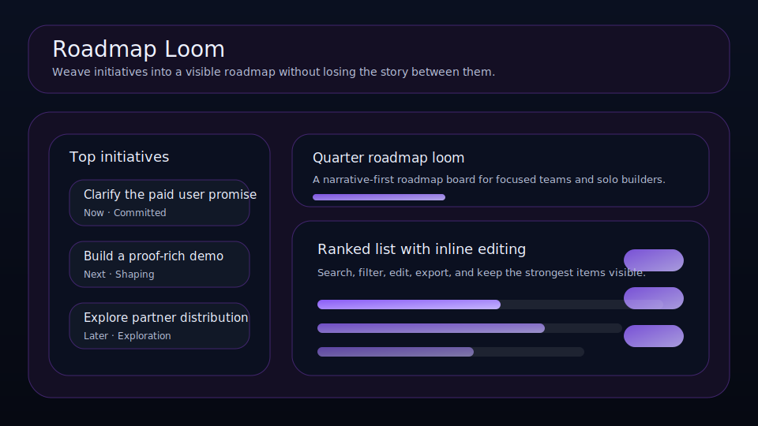

# Roadmap Loom

Weave initiatives into a visible roadmap without losing the story between them.



Roadmap Loom is a small local-first planning tool for solo builders, operators, and creative teams who want a cleaner way to manage initiatives. Add items, score the signal, track the friction, and keep the strongest opportunities visible without needing a backend or build step.

## Features

- Local-first persistence with `localStorage`
- Search and filter controls
- Ranked list sorted by signal minus friction
- Inline editor for title, notes, type, status, score, and effort
- Import/export JSON backups
- Re-seed action for resetting the sample board
- Keyboard shortcuts: `N` for new, `/` for search
- No build tooling, just open in a browser

## Quick start

```bash
git clone https://github.com/<you>/roadmap-loom.git
cd roadmap-loom
python -m http.server 8000
```

Then open <http://localhost:8000>.

## Data shape

```json
{
  "boardTitle": "Quarter roadmap loom",
  "items": [
    {
      "title": "Clarify the paid user promise",
      "category": "Now",
      "state": "Committed",
      "score": 10,
      "effort": 3
    }
  ]
}
```

## Privacy

Everything stays in your browser unless you export a JSON backup.

## License

MIT
